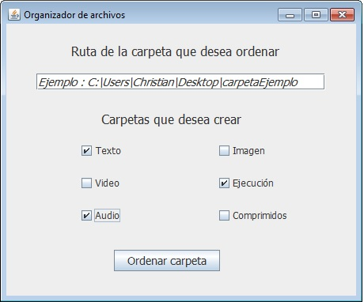

# Programa-ordenar-archivos

El siguiente programa sirve para ordenar los archivos comunes de una carpeta, funciona tomando el path de una carpeta (C:\Users\Christian\Desktop\carpetaEjemplo) , 
la cual queremos ordenar y creando el tipo de carpeta seleccionada en los checkbox, dependiendo el tipo de carpeta que se cree es el tipo de archivo que se va a ordenar ,
por ejemplo si creamos la carpeta texto unicamente se ordenaran la mayoría de archivos de texto con extensión .doc , .docx , .pdf etc. A partir de la extensión del archivo
es donde sera destinada , el programa soporta y puede mover los archivos con las siguientes extensiones: 

Archivos de texto:      .txt , .docx, .pdf , .xlsx , .pptx , .doc , .ppt

Archivos de imagen:     .jpg , .jpeg , .png

Archivos de video:      .avi , .divx , .mov , .mp4 , .mkv , .wmv

Archivos ejecutables:   .exe , .bat , .dll , .msi

Archivos de audio:      .mp3, .wma , .wav , .midi

Archivos comprimidos:   .zip , .rar , .rar5

